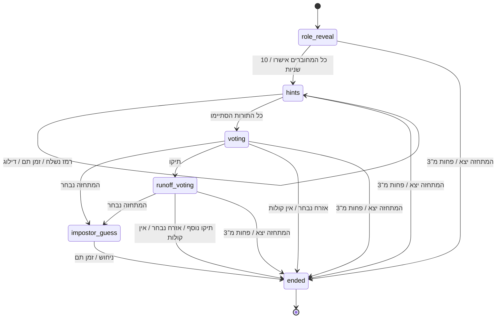
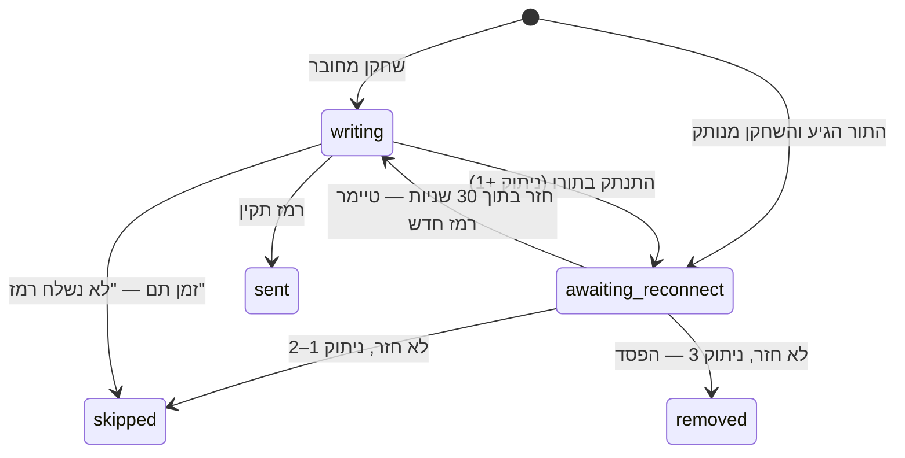
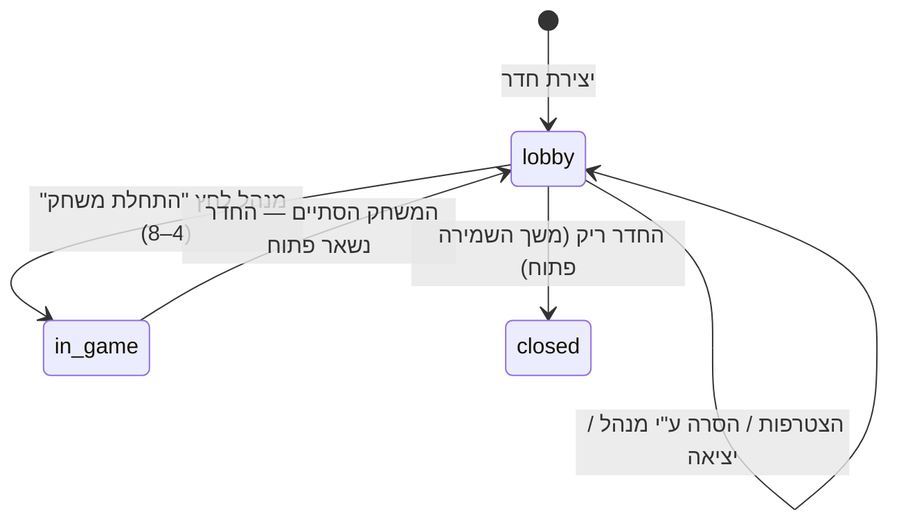
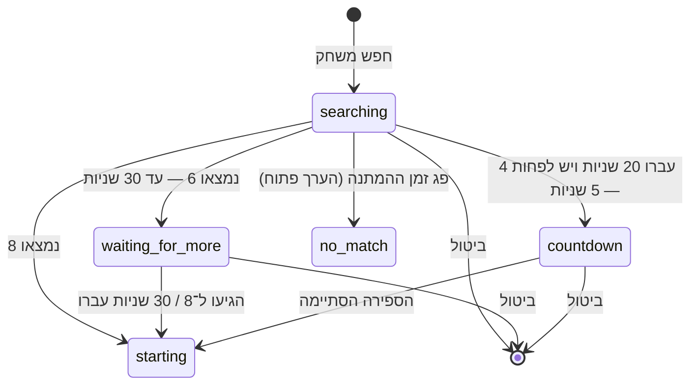

# ארכיטקטורה

מסמך זה מתאר את המבנה הטכני של `מי המתחזה?`. חוזי ה־REST וה־WebSocket נמצאים ב־[`protocol.md`](protocol.md). חוקי המוצר נשארים במסמכי ה־`docs/` האחרים; המסמך הזה אינו משנה אותם.

## החלטות טכניות

- אפליקציית Client אחת ב־**Flutter** ל־Android ול־iPhone.
- שרת ב־**Go**.
- **monorepo** אחד לאפליקציה, לשרת, לתיעוד ולנכסים.
- ספק Hosting, מסד נתונים ו־Analytics טרם נבחרו.

## מבנה המאגר

```text
Imposter-IL/
├── app/                  # Flutter (טרם נוצר)
├── server/               # Go module: github.com/dorohayon/Imposter-IL/server
│   ├── cmd/server/       # נקודת הכניסה: HTTP, /healthz, graceful shutdown
│   └── internal/game/    # מנוע המשחק — ללא HTTP, WebSocket או מסד נתונים
├── assets/               # אווטארים ואילוסטרציות
├── docs/                 # אפיון, ארכיטקטורה ופרוטוקול
├── wireframes/
└── .github/workflows/    # CI
```

חבילות שיתווספו בשרת כשיגיע תורן, ולא לפני כן: `internal/realtime` (WebSocket), `internal/room`, `internal/matchmaking`, `internal/api` (REST) ו־`internal/store`.

## עקרונות

1. **השרת סמכותי.** כל שלב, טיימר, תור, הצבעה ותוצאה נקבעים בשרת. האפליקציה שולחת כוונות (`game.submitHint`) ומציגה את מה שהשרת מחזיר.
2. **Snapshot לכל שחקן.** אחרי כל שינוי השרת שולח לכל שחקן `game.state` מלא ומסונן עבורו. המתחזה לעולם אינו מקבל את המילה לפני סוף המשחק, ואף שחקן אינו מקבל תפקידים או הצבעות של אחרים לפני הסיום. אותו Snapshot משמש גם לחיבור מחדש.
3. **גרסה מונוטונית.** לכל משחק יש `stateVersion` שרק עולה. האפליקציה מתעלמת מ־Snapshot עם גרסה ישנה או זהה, ולכן אירוע רשת ישן אינו מחזיר מסך לשלב קודם.
4. **פקודות אחרי טיימרים.** כל פקודה מפעילה קודם את הטיימרים שפגו. רמז או הצבעה שמגיעים אחרי סוף הזמן נדחים גם אם יצאו מהמכשיר בזמן.
5. **Idempotency.** לכל הודעה מהאפליקציה יש `id` ייחודי. השרת זוכר תשובות אחרונות לכל session ומחזיר את אותה תשובה להודעה חוזרת, כך שלחיצה כפולה או ניסיון חוזר ברשת אינם שולחים רמז או קול פעמיים.
6. **Actor לכל משחק.** מופע `game.Game` אינו thread-safe. בשכבת ה־realtime כל משחק ירוץ ב־goroutine אחת שמקבלת פקודות מ־channel ומתזמנת `Tick` לפי `Deadline()`.
7. **זיכרון בלבד ב־MVP.** משחקים פעילים נשמרים בזיכרון התהליך. אם השרת קורס, המשחק אובד, האפליקציה מקבלת `game_not_found` בחיבור מחדש ומציגה את מסך `תקלה בשרת`. ניצחונות והפסדים נקבעים רק בסוף משחק או ביציאה יזומה/הוצאה, ולכן קריסה אינה רושמת הפסד.

## אחריות הרכיבים

| רכיב | אחריות |
| --- | --- |
| `app/` (Flutter) | UI, RTL, ניווט, שמירת כינוי ואווטאר מקומית, חיבור REST ו־WebSocket, חיבור מחדש אוטומטי והצגת Snapshots. אינו מחשב חוקים או טיימרים. |
| `cmd/server` | הרכבת השרת, הגדרות מסביבה (`PORT`), `/healthz`, כיבוי מסודר. |
| `internal/game` | State Machine של משחק יחיד: תפקידים, תורות, רמזים, תגובות, הצבעה, ניחוש, ניתוקים, יציאות ותוצאה. מקבל זמן ו־RNG מבחוץ. |
| `internal/room` (עתידי) | חדר פרטי: קוד, רשימת שחקנים, מנהל, הסרה, נעילת הגדרות, העברת ניהול ומשחק נוסף. |
| `internal/matchmaking` (עתידי) | תור חיפוש לפי קטגוריות, יעד 6, המתנה לעד 8 וספירה לאחור. |
| `internal/realtime` (עתידי) | WebSocket, sessions, idempotency, Actor לכל משחק ושליחת Snapshots. |

### ארכיטקטורת Flutter מוצעת

שכבות: `presentation` (מסכים ורכיבי Design System), `state` (מצב מסך שנגזר מ־Snapshot אחרון), `data` (לקוח REST, לקוח WebSocket, אחסון מקומי). בחירת ספריות ניהול State וניווט תיעשה ביצירת הפרויקט.

## State Machines

### משחק (`internal/game`) — ממומש



| שלב | טיימר | יוצאים ממנו כאשר |
| --- | --- | --- |
| `role_reveal` | 10 שניות | כל השחקנים הפעילים והמחוברים לחצו `הבנתי`, או שהזמן תם |
| `hints` | 15 שניות לתור (10/15/20 בחדר פרטי); 30 שניות אם השחקן מנותק | כל שחקן פעיל קיבל תור אחד בסדר אקראי |
| `voting` | 20 שניות, לא מסתיים מוקדם | הזמן תם |
| `runoff_voting` | 15 שניות, רק השחקנים שבתיקו | הזמן תם |
| `impostor_guess` | 15 שניות, ניסיון אחד | ניחוש נשלח או הזמן תם |
| `ended` | — | — |

סיבות סיום (`EndReason`): `impostor_not_caught`, `second_tie`, `impostor_guessed_word`, `impostor_guess_wrong`, `impostor_guess_timeout`, `impostor_gone`, `not_enough_players`.

תוצאה לכל שחקן: שחקן שיצא או הוצא — הפסד. ניצחון אזרחים — כל האזרחים שנשארו מנצחים. ניצחון מתחזה — המתחזה מנצח והאזרחים מפסידים. `not_enough_players` — כל הנשארים מנצחים.

### חיבור לתור (`hints`)



כל ניתוק במהלך משחק פעיל נספר, בכל שלב. ניתוק שלישי, גם מחוץ לתור, פותח 30 שניות; שחקן שלא חזר בזמן מוצא ומקבל הפסד. ניתוק אחרי סוף המשחק אינו נספר.

### חדר פרטי (`internal/room`) — מתוכנן



כללים: עד 8 שחקנים (המנהל בוחר 4–8); ההגדרות ננעלות ברגע ששחקן נוסף מצטרף; רק המנהל מסיר, ורק שחקנים אחרים. ניתוק מנהל פותח חלון של 30 שניות; אם לא חזר, הניהול עובר לשחקן המחובר שהצטרף ראשון מבין הנותרים ואינו חוזר למנהל המקורי. יציאה יזומה של המנהל או הוצאה בניתוק שלישי מעבירות את הניהול מיד.

### חיפוש משחק (`internal/matchmaking`) — מתוכנן



אין מעבר אוטומטי לקטגוריה אחרת. היחס בין הספירה של 5 השניות לבין ההמתנה של 30 השניות (למשל שחקן שישי שמצטרף בזמן הספירה, או שחקן שמבטל ומוריד את התור מתחת ל־4) יוגדר לפני מימוש ה־Matchmaking. שילוב הקטגוריות בתור תלוי ברשימת הקטגוריות שעדיין פתוחה.

## מה נשאר מחוץ לקוד כרגע

המנוע אינו בוחר קטגוריה או מילה ואינו מכיל מילון, נרמול עברית, השוואת רמזים כפולים, השוואת ניחוש או רשימת תגובות. כל אלה מוזרקים דרך `game.Policy`, והמנוע מסרב להיווצר בלעדיהם כדי שאף ברירת מחדל זמנית לא תהפוך בשקט להחלטת מוצר. המנוע כן אוכף את החוקים שכבר אושרו: מילה אחת (ללא רווחים), עד 25 תווים (Unicode code points), ללא תוכן ריק.

## מקרי קצה שאושרו בתכנון המנוע

- כל ניתוק במהלך המשחק נספר; הניתוק השלישי מוציא את השחקן אם לא חזר בתוך 30 שניות.
- שחקן שחוזר בתוך 30 השניות בזמן התור שלו מקבל טיימר רמז מלא מחדש.
- אם המתחזה יוצא או מוצא, המשחק מסתיים וכל האזרחים שנשארו מנצחים (`impostor_gone`).
- אם אף שחקן לא הצביע, המתחזה מנצח (`impostor_not_caught`).
- קול של שחקן שמנותק בסוף ההצבעה אינו נספר.
- אפשר להגיב לרמזים עד סוף המשחק.
- הצבעה חוזרת נמשכת 15 שניות.
- לחשיפת תפקיד יש 10 שניות; לאחר מכן המשחק ממשיך לרמזים גם אם לא כולם אישרו.

## הרצה מקומית

```sh
cd server
go test -race ./...
go run ./cmd/server        # PORT=8080 כברירת מחדל
curl localhost:8080/healthz
```
