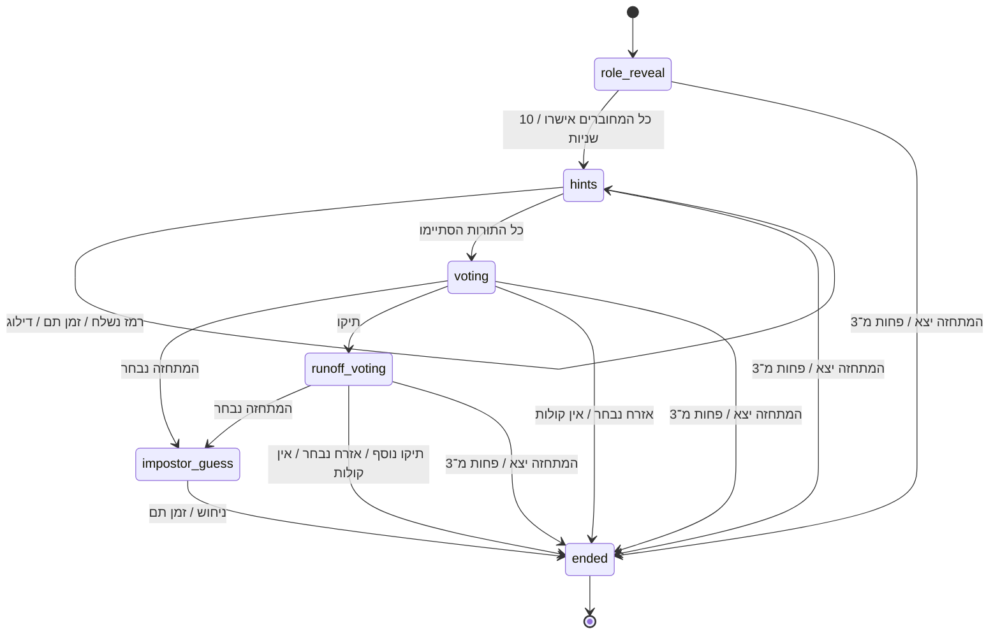
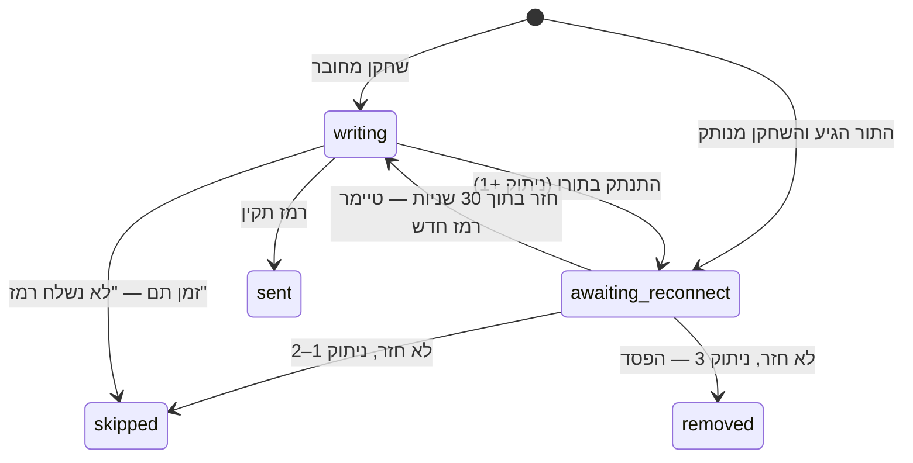
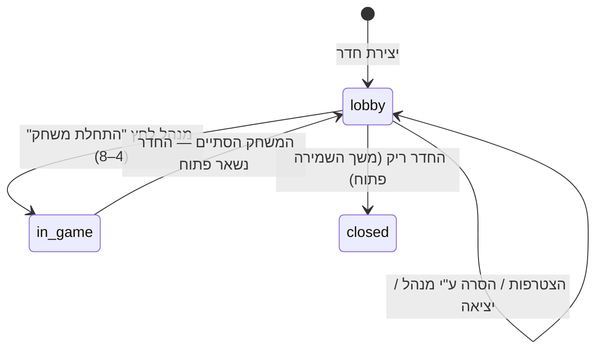
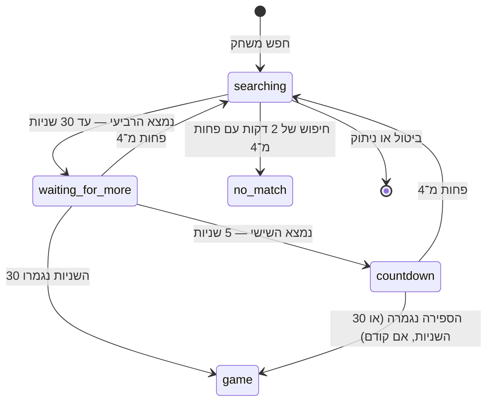

# ארכיטקטורה

מסמך זה מתאר את המבנה הטכני של `מי המתחזה?`. חוזי ה־REST וה־WebSocket נמצאים ב־[`protocol.md`](protocol.md). חוקי המוצר נשארים במסמכי ה־`docs/` האחרים; המסמך הזה אינו משנה אותם.

## החלטות טכניות

- אפליקציית Client אחת ב־**Flutter** ל־Android ול־iPhone.
- שרת ב־**Go**.
- **monorepo** אחד לאפליקציה, לשרת, לתיעוד ולנכסים.
- **Hosting**: מכונה אחת ב־Google Compute Engine (`e2-micro`, `us-central1`, ה־Free Tier), עם Caddy ל־TLS. הנימוק והחלופות: [`production-architecture-review.md`](production-architecture-review.md), והנוהל המלא ב־[`deploy/README.md`](../deploy/README.md). התכונה שפוסלת מארחים: הפלטפורמה לא יכולה לעצור את התהליך בזמן שהיא בוחרת, כי המשחקים בזיכרון וצריכים חלון כיבוי מסודר — ולכן Cloud Run ו־Lambda אינם מתאימים.
- **מסד נתונים**: אין, ואין צורך בו. הניצחונות וההפסדים במכשיר, ומשחק פעיל אינו שווה דבר אחרי הפעלה מחדש.
- Analytics טרם נבחר. דיווח קריסות באפליקציה טרם נבחר.

## מבנה המאגר

```text
Imposter-IL/
├── app/                  # Flutter: משחק ברשת וחדרים פרטיים, מחוברים לשרת
├── server/               # Go module: github.com/dorohayon/Imposter-IL/server
│   ├── cmd/server/       # נקודת הכניסה: HTTP, /healthz, /readyz, metrics, drain
│   ├── cmd/loadbot/      # שחקנים מדומים למדידת קיבולת
│   ├── internal/game/    # מנוע המשחק — ללא HTTP, WebSocket או מסד נתונים
│   ├── internal/room/    # חדר פרטי — עוטף משחקים, גם הוא ללא תקשורת
│   ├── internal/matchmaking/ # כללי ההתחלה של משחק ברשת: טיימרים וקטגוריות משותפות
│   ├── internal/content/ # הקטגוריות, המילים והתגובות שאושרו
│   └── internal/api/     # REST ו־WebSocket: sessions אורח, חדרים ו־Snapshots, בזיכרון
├── assets/               # אווטארים ואילוסטרציות
├── deploy/               # Caddy, docker compose ונוהל ההרצה ב־GCE
├── docs/                 # אפיון, ארכיטקטורה ופרוטוקול
├── wireframes/
└── .github/workflows/    # CI
```

חבילות שיתווספו בשרת כשיגיע תורן, ולא לפני כן: `internal/store`. ההיערכות להרצה על יותר ממופע אחד מתוארת ב־[`production-architecture-review.md`](production-architecture-review.md) (Stage 1): מנוע המשחק אינו משתנה שם, רק הניתוב. ה־WebSocket נמצא ב־`internal/api` לצד ה־REST, כי שניהם עובדים על אותם sessions וחדרים. תלות חיצונית יחידה: `github.com/coder/websocket`.

## עקרונות

1. **השרת סמכותי.** כל שלב, טיימר, תור, הצבעה ותוצאה נקבעים בשרת. האפליקציה שולחת כוונות (`game.submitHint`) ומציגה את מה שהשרת מחזיר.
2. **Snapshot לכל שחקן.** אחרי כל שינוי השרת שולח לכל שחקן `game.state` מלא ומסונן עבורו. המתחזה לעולם אינו מקבל את המילה לפני סוף המשחק, ואף שחקן אינו מקבל תפקידים או הצבעות של אחרים לפני הסיום. אותו Snapshot משמש גם לחיבור מחדש.
3. **גרסה מונוטונית.** כל Snapshot של חדר או של משחק בו נושא `stateVersion` שרק עולה, גם בין משחקים באותו חדר. השרת שומר איזו גרסת חדר ומשחק פורסמה לאחרונה, ומפרסם שוב אחרי כל פקודה, בקשת REST או טיימר שקידמו אותן, גם אם הפקודה עצמה נכשלה. האפליקציה מתעלמת מ־Snapshot עם גרסה ישנה או זהה, ולכן אירוע רשת ישן אינו מחזיר מסך לשלב קודם.
4. **פקודות אחרי טיימרים.** כל פקודה מפעילה קודם את הטיימרים שפגו. רמז או הצבעה שמגיעים אחרי סוף הזמן נדחים גם אם יצאו מהמכשיר בזמן.
5. **Idempotency.** לכל הודעה מהאפליקציה יש `id` ייחודי. השרת זוכר תשובות אחרונות לכל session ומחזיר את אותה תשובה להודעה חוזרת, כך שלחיצה כפולה או ניסיון חוזר ברשת אינם שולחים רמז או קול פעמיים.
6. **סדרתיות.** מופעי `game.Game` ו־`room.Room` אינם thread-safe. ב־MVP כל הפקודות, הטיימרים ושינויי החיבור עוברים דרך מנעול אחד ב־`internal/api`, ולכל חדר יש `time.Timer` שמופעל לפי `Deadline()`. אם יתגלה עומס על המנעול, כל חדר יעבור ל־goroutine משלו שמקבלת פקודות מ־channel. כתיבה לרשת לעולם אינה מתבצעת תחת המנעול: לכל חיבור יש תור יוצא ו־goroutine כותבת.
7. **זיכרון בלבד ב־MVP.** משחקים פעילים נשמרים בזיכרון התהליך. אם השרת קורס, ה־sessions, החדרים והמשחקים אובדים, האפליקציה מקבלת `401 session_not_found` בחיבור מחדש ומציגה את מסך `תקלה בשרת`. ניצחונות והפסדים נקבעים רק בסוף משחק או ביציאה יזומה/הוצאה, ולכן קריסה אינה רושמת הפסד.
8. **כיבוי מסודר.** מכיוון שהכול בזיכרון, `SIGTERM` אינו מפיל את השרת מיד: הוא מפסיק לקבל פעילות חדשה, ממתין שהמשחקים הפעילים יסתיימו (עד `DRAIN_TIMEOUT`) ורק אז יוצא. `/readyz` מחזיר `503` לאורך כל הזמן הזה ו־`/healthz` ממשיך `200`.
9. **כשל מוכל.** אין `panic` שמפיל את התהליך. `panic` בטיימר, בפקודה או בבקשת REST נתפס, נספר, והחדר שלו נסגר עם `game.aborted` (בלי הפסד) — שאר המשחקים באותו מופע ממשיכים.
10. **גבולות.** שום דבר אינו חי לנצח: session ללא פעילות נמחק אחרי 24 שעות, חדר ריק אחרי 30 דקות. יצירת session, הצטרפות לחדר ופקודות WebSocket מוגבלות בקצב — זו הבקרה היחידה נגד ניצול לרעה, כי אין חשבונות.

## אחריות הרכיבים

| רכיב | אחריות |
| --- | --- |
| `app/` (Flutter) | UI, RTL, ניווט, שמירת כינוי ואווטאר מקומית, חיבור REST ו־WebSocket, חיבור מחדש אוטומטי והצגת Snapshots. אינו מחשב חוקים או טיימרים. |
| `cmd/server` | הרכבת השרת, הגדרות מסביבה, `/healthz` ו־`/readyz`, `/metrics` במאזין פרטי, לוגים ב־JSON (`log/slog`) וכיבוי מסודר עם המתנה למשחקים. |
| `cmd/loadbot` | שחקנים מדומים מול הפרוטוקול האמיתי, למדידת תקרת הקיבולת. |
| `internal/game` | State Machine של משחק יחיד: תפקידים, תורות, רמזים, תגובות, הצבעה, ניחוש, ניתוקים, יציאות ותוצאה. מקבל זמן ו־RNG מבחוץ. |
| `internal/room` | חדר פרטי: קוד, רשימת שחקנים, מנהל, הסרה, נעילת הגדרות, העברת ניהול ומשחק נוסף. |
| `internal/content` | הקטגוריות, המילים והתגובות שאושרו, בחירת מילה, בדיקת מזהים ורשימת המילים החסומות לרמזים ולכינויים. |
| `internal/api` | REST ו־WebSocket: sessions אורח (כינוי ואווטאר), קטגוריות ותגובות, יצירת חדר עם קוד ייחודי והצטרפות לפי קוד, חיבור אחד לכל session, idempotency, ping, פקודות חדר ומשחק, טיימרים ושליחת `session.state`, `room.state`, `game.state` ו־`game.reaction`. מחזיק הכול בזיכרון מאחורי מנעול אחד. |
| `internal/matchmaking` | כללי ההתחלה של משחק ברשת (30 שניות מ־4, 5 שניות מ־6, 2 דקות ל־`לא נמצא משחק מתאים`) וחיתוך קטגוריות. `internal/api` מחזיק את קבוצות החיפוש. |

### ארכיטקטורת Flutter

- `lib/data/server.dart` — לקוח REST ו־WebSocket על `dart:io`, בלי ספריות רשת. כתובת השרת מ־`--dart-define=IMPOSTER_SERVER`.
- `lib/data/models.dart` — מודלים מוקלדים ל־`Room`, `GameView`, קטגוריות ותגובות.
- `lib/state/game_session.dart` — `GameSession` (`ChangeNotifier`) שמוזרק דרך `SessionScope` (`InheritedNotifier`), בלי ספריית ניהול State. מחזיק את זהות האורח (נשמרת ב־`shared_preferences`), לולאת חיבור מחדש, תשובות לפקודות, ה־Snapshot האחרון של החדר והמשחק, התעלמות מ־`stateVersion` ישן, והיסט השעון מול `serverTime`. שם נשמרים גם ניצחונות והפסדים (במכשיר בלבד; כל משחק נספר פעם אחת לפי מזהה) והגדרות הרטט והתגובות.
- `lib/screens/live_room.dart` — מסך אחד שמחליף לפי ה־Snapshot בין חיפוש משחק ברשת (כולל `לא נמצא משחק מתאים`), לובי של חדר פרטי ושלבי המשחק, כולל מסכי הוצאה, תקלה בשרת והודעת חיבור מחדש.
- ניווט ב־`Navigator` הרגיל. בדיקות Widget משתמשות בשרת מדומה (`test/support/fake_server.dart`), ובדיקות ה־End-to-End (`test/e2e`) מריצות את שכבת ה־session מול השרת האמיתי, בחדר פרטי ובמשחק ברשת.

## State Machines

### משחק (`internal/game`) — ממומש



| שלב | טיימר | יוצאים ממנו כאשר |
| --- | --- | --- |
| `role_reveal` | 10 שניות | כל השחקנים הפעילים והמחוברים לחצו `הבנתי`, או שהזמן תם |
| `hints` | 15 שניות לתור (10/15/20 בחדר פרטי); 30 שניות אם השחקן מנותק | כל שחקן פעיל קיבל תור אחד בסדר אקראי |
| `voting` | 20 שניות, לא מסתיים מוקדם | הזמן תם |
| `runoff_voting` | 15 שניות, רק השחקנים שבתיקו | הזמן תם |
| `impostor_guess` | 15 שניות, ניסיון אחד | ניחוש נשלח או הזמן תם |
| `ended` | — | — |

סיבות סיום (`EndReason`): `impostor_not_caught`, `second_tie`, `impostor_guessed_word`, `impostor_guess_wrong`, `impostor_guess_timeout`, `impostor_gone`, `not_enough_players`.

תוצאה לכל שחקן: שחקן שיצא או הוצא — הפסד. ניצחון אזרחים — כל האזרחים שנשארו מנצחים. ניצחון מתחזה — המתחזה מנצח והאזרחים מפסידים. `not_enough_players` — כל הנשארים מנצחים.

### חיבור לתור (`hints`)



כל ניתוק במהלך משחק פעיל נספר, בכל שלב. ניתוק שלישי, גם מחוץ לתור, פותח 30 שניות; שחקן שלא חזר בזמן מוצא ומקבל הפסד. ניתוק אחרי סוף המשחק אינו נספר.

### חדר פרטי (`internal/room`) — ממומש



כללים: עד 8 שחקנים (המנהל בוחר 4–8); ההגדרות ננעלות ברגע ששחקן נוסף מצטרף; רק המנהל מסיר, ורק שחקנים אחרים. ניתוק מנהל פותח חלון של 30 שניות; אם לא חזר, הניהול עובר לשחקן המחובר שהצטרף ראשון מבין הנותרים ואינו חוזר למנהל המקורי. יציאה יזומה של המנהל או הוצאה בניתוק שלישי מעבירות את הניהול מיד.

פרטי מימוש:

- כמו המנוע, החדר מקבל זמן ו־RNG מבחוץ ואינו thread-safe. `internal/api` מנהל את המיפוי מקוד לחדר, את ייחודיות הקודים ואת הטיימרים.
- פקודות משחק עוברות דרך `Room.WithGame`, כדי שהחדר יסיר שחקנים שיצאו או הוצאו ויחזור ללובי כשהמשחק מסתיים. יציאה, ניתוק וחיבור מחדש נשלחים לחדר, והוא מעביר אותם למשחק.
- `התחלת משחק` מצרפת את כל חברי החדר, והמינימום של 4 נספר מכולם. חבר מנותק נכנס למשחק דרך `Game.MarkOffline`, שאינו סופר ניתוק. משך הרמז נלקח מהגדרות החדר.
- ההגדרות ננעלות לצמיתות ברגע שהצטרף שחקן נוסף, גם אם יצא אחר כך.
- כשהזמן של מנהל מנותק נגמר ואין אף חבר אחר מחובר, לחדר אין מנהל עד שחבר אחר מתחבר מחדש או מצטרף, והניהול עובר אליו (`host_timeout`). המנהל המקורי אינו מקבל את הניהול בחזרה גם אם חזר ראשון. מנהל שיצא או הוצא מוחלף תמיד כל עוד נשארו חברים; אם המנהל החדש מנותק, מתחילות 30 השניות שלו.
- חדר ריק מדווח `Empty()`. משך שמירת חדר ריק פתוח, ולכן סגירתו באחריות הקורא. עד שייסגר הקוד שלו ממשיך לעבוד, והשחקן הראשון שמצטרף אליו הופך למנהל.

### חיפוש משחק (`internal/matchmaking`) — ממומש



אין מעבר אוטומטי לקטגוריה אחרת. ביטול בזמן הספירה אינו עוצר אותה כל עוד נשארו 4, וירידה מתחת ל־4 מאפסת את הטיימרים.

פרטי מימוש:

- כל קבוצת חיפוש היא חדר ציבורי ב־`internal/api`: `room.Room` בלי קוד ובלי פקודות מנהל. בלובי החברים הם בדיוק השחקנים שמחפשים, והמשחק מתחיל ב־`Room.StartByServer`. כך משחק ברשת משתמש באותו מחזור חיים, ניתוקים, הוצאות ו־Snapshots כמו חדר פרטי.
- שחקן מצטרף לקבוצה הגדולה ביותר שעדיין בלובי, שיש בה פחות מ־8 ושחולקת איתו לפחות קטגוריה אחת. הקטגוריות של הקבוצה הן החיתוך של כל המחפשים, והמילה נבחרת מהן.
- כשמשחק ברשת מסתיים כל השחקנים משתחררים מהחדר ורואים את התוצאה דרך ה־session. מי שבוחר `משחק נוסף` מחפש שוב עם אותן קטגוריות, ולכן מגיע לאותה קבוצה.
- ניתוק בזמן חיפוש מבטל אותו. ניתוק במהלך משחק ברשת מטופל כמו בחדר פרטי.

## מה נשאר מחוץ לקוד כרגע

המנוע אינו בוחר קטגוריה או מילה (`internal/content` עושה זאת ב־`room.start`) ואינו מכיל מילון תוכן לא ראוי או רשימת תגובות. שניהם מוזרקים דרך `game.Policy`: `content.Policy()` מספק את התגובות שאושרו ובדיקת תוכן לא ראוי שאינה חוסמת דבר, כי הוחלט שבשלב זה אין חסימה. מילון עתידי יתחבר ל־`HintInappropriate` בלי לשנות את המנוע. המנוע מסרב להיווצר בלי מדיניות מלאה. המנוע כן אוכף את החוקים שכבר אושרו: מילה אחת (ללא רווחים), עד 25 תווים (Unicode code points), ללא תוכן ריק, וכללי השוואת המילים שב־`docs/decisions.md` (`internal/game/words.go`): חסימת המילה הסודית לאזרחים בלבד, רמז כפול עם אותיות שימוש וניחוש מנורמל.

## מקרי קצה שאושרו בתכנון המנוע

- כל ניתוק במהלך המשחק נספר; הניתוק השלישי מוציא את השחקן אם לא חזר בתוך 30 שניות.
- שחקן שחוזר בתוך 30 השניות בזמן התור שלו מקבל טיימר רמז מלא מחדש.
- אם המתחזה יוצא או מוצא, המשחק מסתיים וכל האזרחים שנשארו מנצחים (`impostor_gone`).
- אם אף שחקן לא הצביע, המתחזה מנצח (`impostor_not_caught`).
- קול של שחקן שמנותק בסוף ההצבעה אינו נספר.
- אפשר להגיב לרמזים עד סוף המשחק.
- הצבעה חוזרת נמשכת 15 שניות.
- לחשיפת תפקיד יש 10 שניות; לאחר מכן המשחק ממשיך לרמזים גם אם לא כולם אישרו.

## הרצה מקומית

```sh
cd server
go test -race ./...
go run ./cmd/server        # PORT=8080 כברירת מחדל
curl localhost:8080/healthz
```
